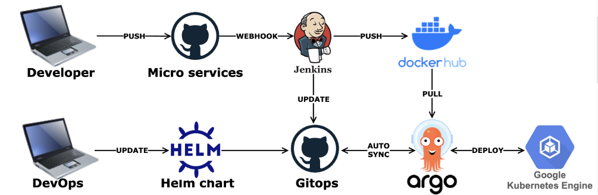

# **내 손 안의 작은 전시회 플랫폼, _Esthète_**

<div align="left">

### Tech Stack

**FE**


**UX·UI**


**BE**


**Infra**


**CO-WORK**

[](https://github.com/)
[](https://www.atlassian.com/software/jira)
[](https://www.notion.so/)

</div>

<br/>

<hr/>

- **Why, 온라인 전시회 플랫폼?**
  ```
  - 사진 저작권 침해, 휘발성 강한 SNS에 대한 불만
  - 누구나 보호받을 수 있는 모바일 전시회 플랫폼
  ```

<hr/>

- **제안**

  > 1.  포트폴리오 기능
  > 2.  작품 의도 전달
  > 3.  전시 체류 시간 증진 필요
  > 4.  저작권 보호
  > 5.  유해 컨텐츠 필터링
  > 6.  위치 기반 사진 검색

- **해결 방안**
  > 1.  전시 PDF 추출 기능
  > 2.  방 단위 전시 공간 분리
  > 3.  Cube Animation 이용 전시 이동 자동 스크롤 5초
  > 4.  MD5 해시 생성 체크섬 DB 저장
  > 5.  Google Cloud Vision API Safe Search
  > 6.  Google map Geocoding API 클러스터링
  > 7.  판매자를 위한 통계 제공
  >     - Chart.js 라이브러리 활용 데이터 시각화
  >     - Redis 활용 통계 등록 중복 방지 구현

---

### CMS Mobile 화면

> 전시 추천 피드

<table>
  <tr>
    <td rowspan="7" align="center"></td>
  </tr>
  <tr>
    <td> <b>스케줄러 캐싱</td>
  </tr>
  <tr>
  <td align="center"></td>
  </tr>
  <tr>
  <td> <b>전시 추천 API 호출 시 </td>
  </tr>
  <tr>
  <td align="center"></td>
  </tr>
  <tr>
  <td> <b>전시 UX 설계 - 체류시간 극대화 및 PDF 다운로드 </td>
  </tr>
  <tr>
  <td> - 전시관에 머무르는 시간 극대화를 위해 상하 스크롤이 아닌 5초마다 자동으로 스크롤 되도록 구성 </br>
  - 본인 전시의 경우 PDF로 다운로드 받아 사진 작가 포트폴리오로 활용가능
 </td>
  </tr>
</table>

> 저작권 필터링

<table>
  <tr>
    <td rowspan="5" align="center"></td>
  </tr>
  <tr>
    <td> <b>사진 업로드 완료 후</td>
  </tr>
  <tr>
  <td align="center"></td>
  </tr>
  <tr>
  <td> <b>사진 업로드 진행 전 </td>
  </tr>
  <tr>
  <td align="center"></td>
  </tr>
</table>

> 유해성 필터링

<table>
  <tr>
    <td rowspan="5" align="center"></td>
  </tr>
  <tr>
    <td> <b>Google Cloud Vision API Safe Search API 활용</td>
  </tr>
  <tr>
  <td align="center"></td>
  </tr>

</table>

> LightMap

<table>
  <tr>
    <td rowspan="5" align="center"></td>
  </tr>
  <tr>
    <td> <b>위치 정보 정규화 저장</td>
  </tr>
  <tr>
  <td align="center"></td>
  </tr>
  <tr>
  <td> <b>SQL GROUP BY문 활용 위치 정보 기반 클러스터링 </td>
  </tr>
  <tr>
  <td align="center"> </td>
  </tr>
</table>

---

### CMS WEB UI 디자인

https://github.com/dgu-web-t3-blackshoe/esthete-cms/assets/102159721/60060860-f86f-4765-bcb2-6ace3d67fa25

https://github.com/dgu-web-t3-blackshoe/esthete-cms/assets/102159721/bc752696-35e7-4747-ac58-ed881cc494b4

https://github.com/dgu-web-t3-blackshoe/esthete-cms/assets/102159721/71fe9dad-3b49-48e1-80d0-2dd02779dc9e

https://github.com/dgu-web-t3-blackshoe/esthete-cms/assets/102159721/581e63e0-e6da-458f-a78e-073a36c7fce9

<hr/>

### 시스템 아키텍처


### GKE 아키텍처


### CICD 파이프라인



<hr/>

### 배포 링크

> https://esthete-cms.vercel.app/

### 유튜브 시연

> https://www.youtube.com/watch?v=B-3IrsyK8B4&list=WL&index=1

### DEV 정리

> https://asheroh.notion.site/Esth-te-039ce99aba8f430b83e14eb66994ab7f
